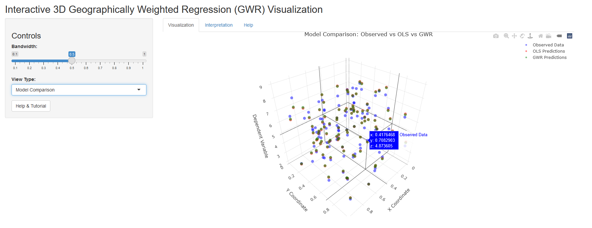

# Interactive 3D Geographically Weighted Regression (GWR) Visualization App

## Overview

This repository contains a Shiny application designed for visualizing the concept of Geographically Weighted Regression (GWR) in an interactive 3D environment. The app is intended as an educational tool, helping users understand how GWR models vary across geographic space by allowing them to interactively explore the results of GWR analyses on spatial data.

## Results

The following image shows a snapshot of the Shinyapp in action:

[](https://mohammedyounes.shinyapps.io/GWR_Viz/)

You can visit and try the application from [here](https://mohammedyounes.shinyapps.io/GWR_Viz/).

## Features

-   **3D Visualization**: Explore spatial data and GWR results in a 3D environment using `plotly`.

-   **Interactive Bandwidth Adjustment**: Dynamically adjust the bandwidth parameter to see how it influences the GWR model, providing a deeper understanding of spatial heterogeneity.

-   **Model Comparison**: Compare the GWR model results with a global Ordinary Least Squares (OLS) regression model to highlight the advantages of GWR in capturing local variations.

-   **Help & Tutorials**: Built-in help and tutorials guide users through the features of the app and the key concepts behind GWR.

## Installation

### Prerequisites

Make sure you have R and RStudio installed on your machine. You'll also need to install the following R packages:

```{r}
install.packages(c("shiny", "plotly", "spgwr", "sp", "spdep", "RColorBrewer"))
```

### Clone the Repository

To get started, clone this repository to your local machine:

```{bash}
git clone https://github.com/mohammedyounes98/GWR_Viz.git
cd GWR_Viz

```

### Running the App

To run the app locally:

1.  Open the `GWR_Viz.R` file in RStudio.

2.  Click the "Run App" button, or use the following command in your R console:

    ```{r}
    shiny::runApp("GWR_Viz.R")
    ```

The app should open in a new window or in your default web browser.

## Usage

### Controls

-   **Bandwidth Slider**: Use this slider to adjust the bandwidth parameter. Smaller bandwidth values result in more localized models, while larger bandwidths approach global regression.

-   **View Type Selector**: Choose between viewing raw data, GWR results, or a comparison between GWR and OLS models.

-   **Help & Tutorial**: Access a step-by-step guide on how to use the app and understand the GWR analysis.

### Interpretation

The app includes a dedicated "Interpretation" tab to help users understand the GWR results. Key points include:

-   **Coefficient Values**: Show the strength and direction of relationships between variables at each location.

-   **Varying Coefficients**: Capture how these relationships change across space.

-   **T-values**: Indicate the statistical significance of local relationships.

### Example Data

The app generates a sample dataset when it starts. You can modify the data generation process in the `app.R` file if you want to experiment with different spatial datasets.

## Contributing

Contributions are welcome! If you have any suggestions for improvements or find any bugs, feel free to open an issue or submit a pull request.

### To Contribute:

1.  Fork the repository.

2.  Create a new branch: `git checkout -b my-feature-branch`

3.  Make your changes and commit them: `git commit -m 'Add some feature'`

4.  Push to the branch: `git push origin my-feature-branch`

5.  Submit a pull request.

## License

This project is licensed under the GNU License. See the LICENSE file for details.

## Acknowledgments

-   The GWR model implementation uses the [`spgwr`](https://github.com/rsbivand/spgwr/) package by [Roger Bivand](https://github.com/rsbivand).

-   The interactive plots are powered by [`plotly`](https://github.com/plotly/plotly.R).
